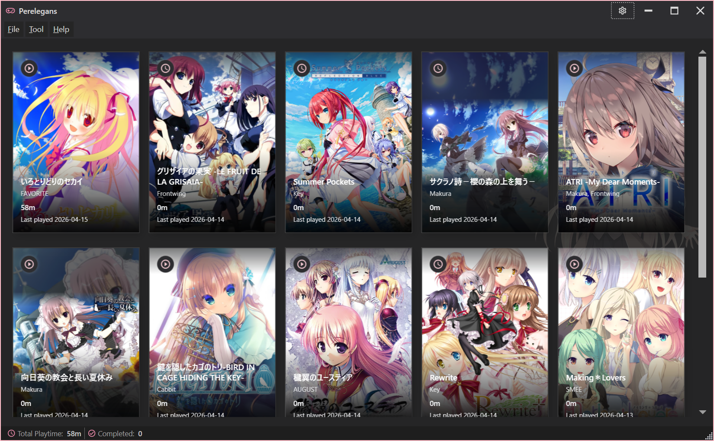

## 说明文档：https://gitblog.cya.moe/Perelegans/

# Perelegans

> 用于追踪视觉小说的游玩时间的 Windows 桌面应用。



## ✨ 功能特性

### 🎮 游玩时间追踪
- 基于进程监控自动记录游玩时长，无需手动操作
- 可自定义监控轮询间隔
- 实时检测游戏运行状态并显示指示器
- 完整的游玩会话历史记录

### 📚 游戏库管理
- 从运行中的进程快速添加游戏
- 支持游戏状态标记：在玩 / 已弃 / 已通关 / 计划中
- 数据库备份与还原

### 🔍 元数据抓取
集成三大数据源，一键补全游戏信息：
- **[VNDB](https://vndb.org/)**
- **[Bangumi](https://bangumi.tv/)**
- **[ErogameSpace](https://erogamescape.dyndns.org)**

自动获取标题、品牌 / 开发商、发售日期、标签、官方网站等信息。

### 🖼️ 封面管理
- 从元数据源搜索并选择高质量封面图
- 支持本地缓存封面，离线可用

### 🤖 AI 游戏推荐
- 基于你的游戏库与玩家口味画像，利用 VNDB 数据智能推荐新作
- 接入 OpenAI 兼容 API，生成个性化推荐理由
- 可自定义 API 地址、密钥与模型

### 💬 AI 自然语言助手
- 以对话方式查询游戏库：「我上个月玩了哪些游戏？」「推荐几部类似 XX 的作品」
- 基于游戏库与游玩数据上下文，由 LLM 生成自然语言回答
- 支持多轮对话、上下文记忆
- 复用「AI 游戏推荐」的 OpenAI 兼容 API 配置

### 📊 游玩统计
- 可视化游玩时间分布
- 游玩时段趋势分析

### 🎨 个性化
- 亮色 / 暗色 / 跟随系统三种主题模式
- MahApps.Metro 现代化 UI 风格
- 支持三种语言：简体中文 · English · 日本語

### 🔧 实用功能
- 系统托盘最小化，后台静默监控
- 开机自启动
- HTTP 代理设置
- 单实例运行保护

## 📦 安装

### 从 Release 下载（推荐）

前往 [Releases](../../releases) 页面下载最新版本的压缩包：

### 从源码构建

**前置要求：**
- [.NET 8 SDK](https://dotnet.microsoft.com/download/dotnet/8.0)

```bash
# 克隆仓库
git clone https://github.com/Shizuku-in/Perelegans.git
cd Perelegans

# 构建
dotnet build src/Perelegans/Perelegans.csproj

# 运行
dotnet run --project src/Perelegans/Perelegans.csproj
```

## 🚀 快速上手

1. **启动应用** — 运行 `Perelegans.exe`
2. **添加游戏** — 先启动你的游戏，然后在应用中点击「从进程添加」选择对应的进程
3. **补全信息** — 右键游戏卡片，选择「获取元数据」自动从 VNDB / Bangumi / 批评空间抓取信息与封面
4. **自动追踪** — 保持应用在后台运行，它会自动监控进程并累计游玩时间
5. **查看统计** — 在主界面查看各游戏的总游玩时长，或打开统计面板查看详细数据

## 🔑 API 接入配置

### Bangumi API 授权

Bangumi 部分接口（如收藏同步、个人数据读写）需要授权，Perelegans 支持 **两种授权方式**，任选其一即可。

#### 方式一：直接生成 Access Token（推荐，简单）

适合个人使用，几分钟即可完成：

1. 登录 [Bangumi](https://bangumi.tv/) 账号
2. 打开 **[https://next.bgm.tv/demo/access-token](https://next.bgm.tv/demo/access-token)**
3. 点击「创建个人令牌」，填写名称（例如 `Perelegans`），选择有效期
4. 复制生成的 **Access Token**
5. 在 Perelegans：`设置` → `元数据源` → `Bangumi` → 粘贴 Token → 保存

> ⚠️ Token 请妥善保管，勿提交到公开仓库。过期后需要重新生成。

#### 方式二：创建 OAuth 应用（高级，支持多账号授权）

适合需要自动刷新 Token 或分发给他人使用的场景：

1. 登录 Bangumi 后访问 **[https://bgm.tv/dev/app](https://bgm.tv/dev/app)**
2. 点击「创建新应用」，填写：
   - **应用名称**：例如 `Perelegans`
   - **应用描述**：用途说明（可选）
   - **主页 URL**：例如 GitHub 仓库地址
   - **回调地址 (Callback URL)**：`http://localhost:32157/callback`（或 Perelegans 设置面板中显示的地址）
3. 创建后获得 **App ID** 和 **App Secret**
4. 在 Perelegans：`设置` → `元数据源` → `Bangumi` → 选择「OAuth 登录」
5. 填入 App ID 与 App Secret → 点击「授权」
6. 浏览器打开 Bangumi 授权页面，点击「同意」即可完成登录
7. Perelegans 将自动管理 Access Token 与 Refresh Token 的刷新

| 对比 | 个人 Token | OAuth 应用 |
|------|------------|------------|
| 配置难度 | ⭐ 简单 | ⭐⭐ 中等 |
| 自动刷新 | ❌ 需手动重新生成 | ✅ 自动刷新 |
| 适用场景 | 个人单机使用 | 多账号 / 长期使用 |
| 有效期 | 自定义（通常 1 年以内） | 长期（自动续期） |

### OpenAI 兼容 API（AI 推荐 / AI 助手）

AI 游戏推荐与 AI 自然语言助手共享同一套 OpenAI 兼容 API 配置：

1. 在 Perelegans：`设置` → `AI` 面板
2. 填写：
   - **API Base URL**：例如 `https://api.openai.com/v1`，或任意兼容服务（DeepSeek、OpenRouter、本地 Ollama 等）
   - **API Key**：你的密钥
   - **模型名称**：例如 `gpt-4o-mini` / `deepseek-chat` / `qwen2.5:7b`
3. 点击「测试连接」验证
4. 保存后即可在「推荐」与「AI 助手」面板使用

> 💡 如需走代理，请在 `设置` → `网络` 中配置 HTTP 代理。

## 🏗️ 技术栈

| 类别 | 技术 |
|------|------|
| 框架 | .NET 8 / WPF |
| UI 库 | [MahApps.Metro](https://mahapps.com/) |
| MVVM | [CommunityToolkit.Mvvm](https://learn.microsoft.com/dotnet/communitytoolkit/mvvm/) |
| 数据库 | [EF Core](https://learn.microsoft.com/ef/core/) + SQLite |
| 图表 | [LiveCharts2](https://livecharts.dev/) |
| 网页解析 | [HtmlAgilityPack](https://html-agility-pack.net/) |
| CI/CD | GitHub Actions |

## 📁 项目结构

```
src/Perelegans/
├── App.xaml(.cs)          # 应用入口，服务初始化，单实例 & 托盘管理
├── Models/                # 数据模型（Game, PlaySession, AppSettings 等）
├── Data/                  # EF Core DbContext
├── Services/              # 业务逻辑层
│   ├── DatabaseService           # 数据库 CRUD
│   ├── ProcessMonitorService     # 进程监控 & 游玩时间记录
│   ├── VndbService               # VNDB API 客户端
│   ├── BangumiService            # Bangumi API 客户端
│   ├── ErogameSpaceService       # ErogameSpace 爬虫
│   ├── RecommendationService     # 游戏推荐引擎
│   ├── AiRecommendationService   # AI 推荐理由生成
│   ├── AiAssistantService        # AI 自然语言助手
│   ├── BangumiOAuthService       # Bangumi OAuth 授权流程
│   ├── CoverArtService           # 封面图获取 & 缓存
│   ├── ThemeService              # 主题切换
│   ├── TranslationService        # 多语言翻译
│   ├── SettingsService           # 设置读写
│   └── StartupRegistrationService # 开机自启注册
├── ViewModels/            # MVVM ViewModel 层
├── Views/                 # XAML 界面
├── Controls/              # 自定义控件（MasonryPanel 瀑布流布局）
├── Converters/            # 值转换器
├── Themes/                # 自定义主题资源字典
└── i18n/                  # 国际化资源文件（.resx）
```

## 📄 许可证

本项目基于 [MIT 许可证](LICENSE) 开源。
