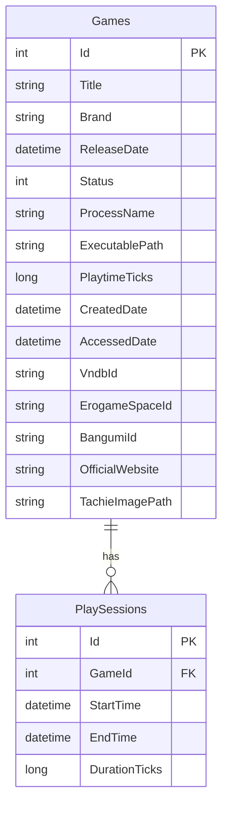

# Perelegans

Perelegans 是一个面向 Windows 的桌面应用，用来管理 Galgame / 视觉小说 / 本地游戏条目，并自动记录游玩时长。项目基于 WPF + .NET 8 构建，采用 MVVM 架构，使用 SQLite 持久化游戏库和游玩日志。

它当前已经具备游戏库管理、进程监控计时、元数据抓取、统计图表、备份恢复、多语言、主题切换、单实例与托盘等完整基础能力，适合作为个人游玩记录工具，也适合作为一个中小型 WPF/MVVM 练手项目继续扩展。

## 简介

这个项目的核心目标，是把“本地游戏管理”和“自动统计游玩时长”结合在一起：

- 你可以手动维护自己的游戏库。
- 你可以从正在运行的进程快速创建条目。
- 你可以从 VNDB、Bangumi、ErogameSpace 拉取元数据。
- 程序会通过轮询本地进程名的方式，自动累计游玩时间，并在游戏退出后生成游玩记录。
- 你可以按最近 7 天、周、月、年查看游玩统计和占比图。

从代码结构上看，这个仓库比较清晰，`App.xaml.cs` 是组合根，服务在启动时手动实例化并注入到 `MainViewModel`，没有引入额外 IoC 容器，适合阅读和继续维护。

## 主要功能

- 游戏库管理：新增、删除、查看游戏条目。
- 从进程添加：扫描当前有窗口的进程，一键填入进程名和可执行文件路径。
- 从网站添加：直接打开元数据窗口，搜索并创建新游戏条目。
- 自动游玩计时：通过 `DispatcherTimer` 定时检查进程是否在运行，自动累计时长。
- 游玩日志记录：进程结束后落库为 `PlaySession`，保留开始时间、结束时间与时长。
- 统计分析：提供最近 7 天、周、月、年四种维度的统计表格与饼图。
- 元数据管理：支持搜索和写入标题、品牌、发行日期、状态、VNDB / Bangumi / EGS ID、官网、可执行文件路径等信息。
- 外部链接跳转：可直接打开 VNDB、Bangumi、ErogameSpace、游戏官网和本地游戏目录。
- 数据备份与恢复：支持 SQLite 数据库的备份与恢复。
- 外观与系统集成：支持浅色 / 深色 / 跟随系统主题、简中 / 英文 / 日文、本机开机自启、关闭时最小化到托盘。
- 单实例运行：通过 Mutex + Named Pipe 保证单实例，并支持激活已有窗口。

## 技术栈

- 平台：Windows 桌面应用
- 框架：`.NET 8`、`WPF`
- 架构：`MVVM`
- UI：`MahApps.Metro`、`MahApps.Metro.IconPacks.Material`
- 数据库：`SQLite`
- ORM：`Entity Framework Core 8`
- 图表：`LiveChartsCore.SkiaSharpView.WPF`
- HTML 解析：`HtmlAgilityPack`
- MVVM 辅助：`CommunityToolkit.Mvvm`

## 快速开始

### 环境要求

- Windows 10 2004 及以上
- .NET 8 SDK

### 构建

```powershell
dotnet build src/Perelegans/Perelegans.csproj
```

### 运行

```powershell
dotnet run --project src/Perelegans/Perelegans.csproj
```

### 发布

```powershell
dotnet publish src/Perelegans/Perelegans.csproj `
  -c Release `
  -r win-x64 `
  --self-contained true `
  -p:PublishSingleFile=true `
  -p:IncludeNativeLibrariesForSelfExtract=true `
  -o publish
```

仓库中还带有 GitHub Actions 发布工作流，会在推送 tag 时自动产出 `win-x64` / `win-x86` 的压缩包。

## 数据文件与运行时行为

程序首次启动时会自动创建本地数据目录：

```text
%LocalAppData%\Perelegans\
```

其中主要文件如下：

- `perelegans.db`：SQLite 主数据库，保存游戏库和游玩日志。
- `settings.json`：应用设置，保存主题、语言、轮询间隔、托盘行为等。

如果启用了“开机自启”，程序会写入以下注册表位置：

```text
HKCU\Software\Microsoft\Windows\CurrentVersion\Run
```

## 项目结构

这一节按“仓库根目录 -> 源码目录 -> 子模块文件”展开，尽量把每个文件的职责写清楚。阅读顺序建议从 `App.xaml.cs`、`MainViewModel.cs`、`DatabaseService.cs`、`ProcessMonitorService.cs` 开始。

### 仓库根目录

| 路径 | 作用 |
| --- | --- |
| `README.md` | 当前项目说明文档，介绍功能、结构、数据库与建议。 |
| `LICENSE` | 项目许可证文件。 |
| `Perelegans.slnx` | 解决方案入口，便于在 Visual Studio / Rider 中打开整个项目。 |
| `.gitignore` | Git 忽略规则，避免构建产物、本地缓存等被提交。 |
| `CLAUDE.md` | 面向代码代理/协作工具的仓库说明，包含构建命令与架构摘要。 |
| `DEVELOPMENT_STEPS.md` | 开发阶段记录，说明项目是如何一步步演进出来的。 |
| `todo.md` | 简短待办记录。 |
| `.github/workflows/release.yml` | GitHub Actions 发布流程；推送 tag 后自动发布 Windows 自包含构建产物。 |
| `artifacts/` | 本地构建、发布或检查时生成的输出目录。 |
| `src/` | 项目源码根目录。 |

### `src/Perelegans/` 顶层文件

| 路径 | 作用 |
| --- | --- |
| `src/Perelegans/Perelegans.csproj` | 项目文件，声明目标框架、WPF/WinForms 开关、NuGet 依赖和资源文件。 |
| `src/Perelegans/App.xaml` | WPF 应用资源入口，合并 MahApps 主题、项目主题和紧凑样式。 |
| `src/Perelegans/App.xaml.cs` | 应用组合根；负责启动初始化、单实例控制、命名管道激活、托盘图标、服务创建和主窗口启动。 |

### `Models/`

| 路径 | 作用 |
| --- | --- |
| `src/Perelegans/Models/Game.cs` | 游戏主实体，包含标题、品牌、进程名、可执行路径、状态、累计时长、元数据 ID 等字段，并挂载 `PlaySessions` 导航属性。 |
| `src/Perelegans/Models/PlaySession.cs` | 单次游玩记录实体，保存所属游戏、开始时间、结束时间和持续时长。 |
| `src/Perelegans/Models/AppSettings.cs` | 应用设置模型，定义主题、语言、监控间隔、代理地址、开机自启、关闭行为等配置项。 |
| `src/Perelegans/Models/ThemeMode.cs` | 主题模式枚举，支持 `System`、`Light`、`Dark`。 |
| `src/Perelegans/Models/MetadataResult.cs` | 元数据搜索结果 DTO，统一承接 VNDB / Bangumi / ErogameSpace 返回的数据。 |

### `Data/`

| 路径 | 作用 |
| --- | --- |
| `src/Perelegans/Data/PerelegansDbContext.cs` | EF Core 的 `DbContext`，定义 `Games` 和 `PlaySessions` 两张表、字段长度、索引、外键关系以及 `TimeSpan` 的 ticks 转换。 |

### `Services/`

| 路径 | 作用 |
| --- | --- |
| `src/Perelegans/Services/DatabaseService.cs` | 数据访问服务，封装建库、游戏 CRUD、游玩日志写入、累计时长更新、备份与恢复。 |
| `src/Perelegans/Services/ProcessMonitorService.cs` | 进程监控服务，通过 `DispatcherTimer` 定时检查本地进程，实时累计游戏时长并在结束时写入 `PlaySession`。 |
| `src/Perelegans/Services/SettingsService.cs` | 设置读写服务，把 `AppSettings` 序列化到 `%LocalAppData%\\Perelegans\\settings.json`。 |
| `src/Perelegans/Services/ThemeService.cs` | 主题服务，负责浅色/深色/跟随系统的切换，以及项目自定义色板资源覆盖。 |
| `src/Perelegans/Services/TranslationService.cs` | 多语言服务，统一读取 `.resx` 文案并在运行时切换界面语言。 |
| `src/Perelegans/Services/StartupRegistrationService.cs` | 开机自启服务，负责写入或移除 Windows `Run` 注册表项。 |
| `src/Perelegans/Services/VndbService.cs` | 元数据源之一，调用 VNDB Kana API 搜索游戏信息。 |
| `src/Perelegans/Services/BangumiService.cs` | 元数据源之一，调用 Bangumi API 搜索条目。 |
| `src/Perelegans/Services/ErogameSpaceService.cs` | 元数据源之一，通过 HTML 抓取 ErogameSpace 搜索结果。 |

### `ViewModels/`

| 路径 | 作用 |
| --- | --- |
| `src/Perelegans/ViewModels/MainViewModel.cs` | 主界面核心 ViewModel，负责游戏列表、统计汇总、菜单命令、右键菜单命令、备份恢复、元数据编辑、启动游戏等主流程。 |
| `src/Perelegans/ViewModels/SettingsViewModel.cs` | 设置窗口 ViewModel，负责绑定主题、语言、监控、代理、开机自启和关闭行为等配置。 |
| `src/Perelegans/ViewModels/MetadataViewModel.cs` | 元数据窗口 ViewModel，负责搜索第三方数据源、回填字段、浏览 EXE 路径和保存游戏信息。 |
| `src/Perelegans/ViewModels/PlaytimeStatsViewModel.cs` | 统计窗口 ViewModel，负责按 7 天 / 周 / 月 / 年聚合 `PlaySession`，并生成饼图和图例数据。 |
| `src/Perelegans/ViewModels/GamePlayLogViewModel.cs` | 单个游戏日志窗口 ViewModel，负责加载并格式化某个游戏的游玩记录列表。 |
| `src/Perelegans/ViewModels/AddFromProcessViewModel.cs` | 从进程添加窗口 ViewModel，负责枚举当前可见进程、排序并供用户选择。 |

### `Views/`

| 路径 | 作用 |
| --- | --- |
| `src/Perelegans/Views/MainWindow.xaml` | 主窗口布局，包含自定义标题栏、菜单栏、状态栏、游戏表格和右键菜单。 |
| `src/Perelegans/Views/MainWindow.xaml.cs` | 主窗口代码后置，处理标题栏拖动、最大化/还原、设置按钮和窗口控制按钮交互。 |
| `src/Perelegans/Views/SettingsWindow.xaml` | 设置窗口布局，分为外观、监控、网络、系统四个设置分组。 |
| `src/Perelegans/Views/SettingsWindow.xaml.cs` | 设置窗口代码后置，负责保存/取消按钮行为和错误提示。 |
| `src/Perelegans/Views/MetadataWindow.xaml` | 元数据窗口布局，包含搜索区、搜索结果表格和可编辑字段表单。 |
| `src/Perelegans/Views/MetadataWindow.xaml.cs` | 元数据窗口代码后置，处理回车搜索、保存、取消等交互。 |
| `src/Perelegans/Views/PlaytimeStatsWindow.xaml` | 统计窗口布局，展示周期表格、摘要指标、饼图和图例列表。 |
| `src/Perelegans/Views/PlaytimeStatsWindow.xaml.cs` | 统计窗口代码后置，负责图表主题同步、图例滚动跟随和悬停清理。 |
| `src/Perelegans/Views/GamePlayLogWindow.xaml` | 单游戏日志窗口布局，展示日期、时间区间和时长列表。 |
| `src/Perelegans/Views/GamePlayLogWindow.xaml.cs` | 单游戏日志窗口代码后置，目前主要承担窗口初始化。 |
| `src/Perelegans/Views/AddFromProcessWindow.xaml` | 从进程添加窗口布局，展示当前进程列表和确认按钮。 |
| `src/Perelegans/Views/AddFromProcessWindow.xaml.cs` | 从进程添加窗口代码后置，负责确认选择与未选择时的提示弹窗。 |

### `Converters/`

| 路径 | 作用 |
| --- | --- |
| `src/Perelegans/Converters/PlaytimeConverter.cs` | 把 `TimeSpan` 转成适合界面展示的 `xh ym` / `xm` 字符串。 |
| `src/Perelegans/Converters/StatusIconConverter.cs` | 把 `GameStatus` 枚举转换成 MahApps 图标种类，用于主表格状态列。 |

### `Themes/`

| 路径 | 作用 |
| --- | --- |
| `src/Perelegans/Themes/LightTheme.xaml` | 浅色主题资源字典，定义窗口、面板、表格、图表等颜色。 |
| `src/Perelegans/Themes/DarkTheme.xaml` | 深色主题资源字典，和浅色主题对应。 |
| `src/Perelegans/Themes/CompactStyles.xaml` | 全局紧凑样式资源，统一按钮、表格、标题栏等控件的密度和外观。 |

### `i18n/`

| 路径 | 作用 |
| --- | --- |
| `src/Perelegans/i18n/Strings.resx` | 默认语言资源文件，当前主要作为英文文案。 |
| `src/Perelegans/i18n/Strings.zh-Hans.resx` | 简体中文资源文件。 |
| `src/Perelegans/i18n/Strings.ja-JP.resx` | 日文资源文件。 |
| `src/Perelegans/i18n/TranslateExtension.cs` | XAML 标记扩展，让界面可以通过 `{i18n:Translate Key}` 直接绑定翻译文本。 |

### `Images/`

| 路径 | 作用 |
| --- | --- |
| `src/Perelegans/Images/sho02A_101.png` | 主界面右下角使用的装饰性背景图片资源。 |

### 可以从哪里开始看代码

如果是第一次阅读这个项目，推荐顺序如下：

1. `src/Perelegans/App.xaml.cs`：先看应用如何启动、初始化服务和主窗口。
2. `src/Perelegans/ViewModels/MainViewModel.cs`：再看主业务流程是怎样组织起来的。
3. `src/Perelegans/Services/DatabaseService.cs` 和 `src/Perelegans/Data/PerelegansDbContext.cs`：了解数据如何存。
4. `src/Perelegans/Services/ProcessMonitorService.cs`：了解自动计时逻辑。
5. `src/Perelegans/ViewModels/MetadataViewModel.cs` 和三个元数据服务：了解第三方数据抓取流程。

## 数据库结构

项目使用 `Entity Framework Core + SQLite`，没有使用迁移目录，当前是在启动时通过 `EnsureCreatedAsync()` 自动建库。

### 实体关系



### `Games` 表

| 字段 | 类型/含义 | 说明 |
| --- | --- | --- |
| `Id` | 主键 | 游戏唯一标识 |
| `Title` | 必填字符串，最长 500 | 游戏标题 |
| `Brand` | 字符串，最长 200 | 品牌 / 社团 / 厂商 |
| `ReleaseDate` | 可空日期 | 发售日期 |
| `Status` | 整型枚举 | `Playing=0`、`Dropped=1`、`Completed=2` |
| `ProcessName` | 字符串，最长 200 | 用于自动监控的进程名 |
| `ExecutablePath` | 字符串，最长 1000 | 本地可执行文件路径 |
| `Playtime` | `TimeSpan`，落库为 ticks | 当前累计游玩时长 |
| `CreatedDate` | 日期时间 | 条目创建时间 |
| `AccessedDate` | 日期时间 | 最近游玩或访问时间 |
| `VndbId` | 可空字符串，最长 50 | VNDB 关联 ID |
| `ErogameSpaceId` | 可空字符串，最长 50 | ErogameSpace 关联 ID |
| `BangumiId` | 可空字符串，最长 50 | Bangumi 关联 ID |
| `OfficialWebsite` | 可空字符串，最长 500 | 官网地址 |

### `PlaySessions` 表

| 字段 | 类型/含义 | 说明 |
| --- | --- | --- |
| `Id` | 主键 | 游玩记录唯一标识 |
| `GameId` | 外键 | 关联到 `Games.Id` |
| `StartTime` | 日期时间 | 本次游玩开始时间 |
| `EndTime` | 日期时间 | 本次游玩结束时间 |
| `Duration` | `TimeSpan`，落库为 ticks | 本次游玩持续时长 |

### 建表与约束说明

- `Games` 与 `PlaySessions` 是一对多关系。
- 删除某个 `Game` 时，其关联的 `PlaySessions` 会级联删除。
- `PlaySessions.GameId` 上建立了索引，便于按游戏查询历史日志。
- `Playtime` 与 `Duration` 在 SQLite 中通过 `long ticks` 做值转换，而不是原生 `time` 类型。

## 功能实现说明

### 进程计时逻辑

- 监控逻辑按固定间隔轮询本机进程列表。
- 当前匹配方式是“进程名匹配”，不是路径匹配，也不是窗口标题匹配。
- 当进程首次出现时，开始一个活动会话。
- 当进程持续存在时，按 Tick 累计时长并实时刷新主界面。
- 当进程消失时，写入一条 `PlaySession`，同时更新 `Game.Playtime` 和 `AccessedDate`。

### 元数据来源

- `VNDB`：通过 Kana API 搜索。
- `Bangumi`：通过公开 API 搜索。
- `ErogameSpace`：通过 HTML 抓取搜索结果页。

### 当前已知现状

- 项目当前没有自动化测试。
- 当前数据库初始化方式是 `EnsureCreated`，更适合个人项目和早期阶段，不利于后续结构演进。

## 建议

### 使用建议

- 首次添加游戏后，尽量补全 `ProcessName` 和 `ExecutablePath`，否则自动计时和一键启动体验会打折扣。
- 恢复数据库备份前，建议先手动另存一次当前数据库，避免误覆盖。
- 如果你希望长期后台计时，可以把“关闭窗口时”设置为“最小化到托盘”。

### 开发建议

1. 把数据库初始化从 `EnsureCreated` 升级为 `EF Core Migrations`，方便后续字段变更和版本升级。
2. 为 `DatabaseService`、`ProcessMonitorService`、元数据服务补充自动化测试。
3. 如果未来要支持大规模数据或多人同步，可以继续抽象仓储层，并补充导入导出、云同步或标签系统。

## 适合作为练手项目的点

- WPF + MVVM 的基础分层较完整。
- 涉及本地数据库、系统托盘、单实例、注册表、自定义主题、多语言、图表等典型桌面端能力。
- 功能闭环明确，但体量还在可控范围内，适合逐步重构和扩展。

## 许可证

本项目采用仓库内的 [LICENSE](LICENSE)。
